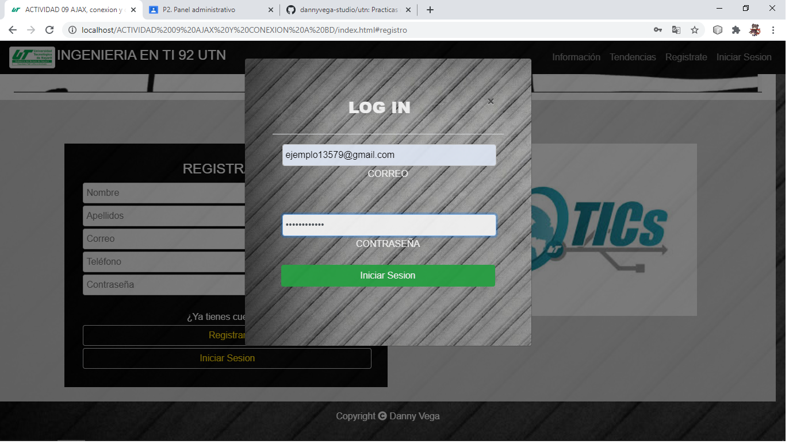
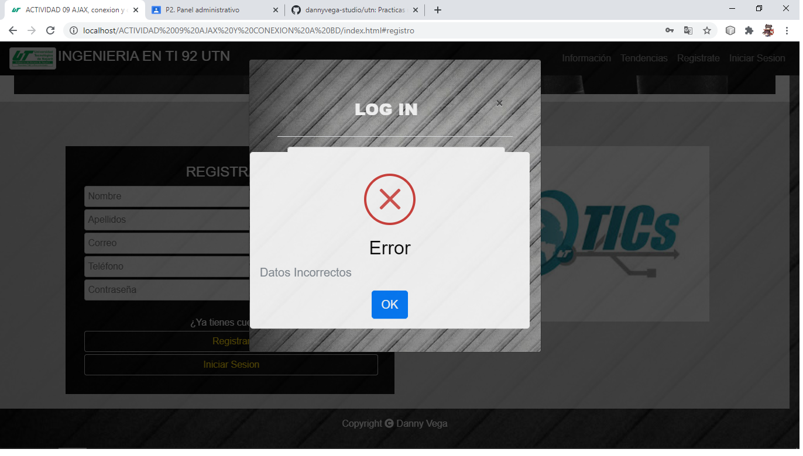
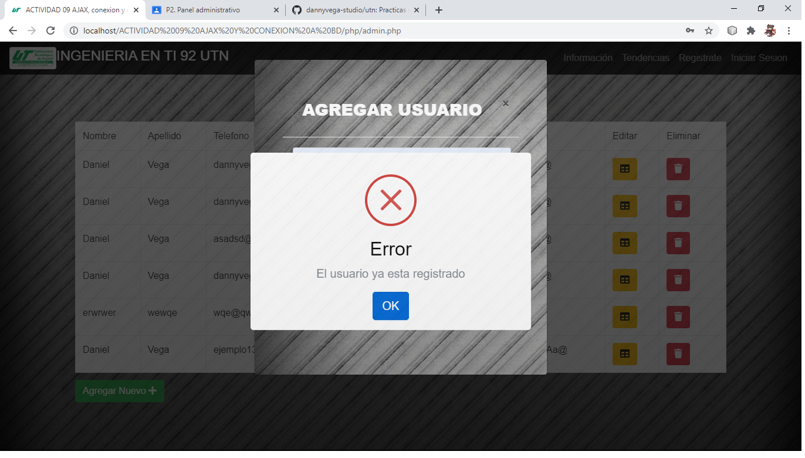
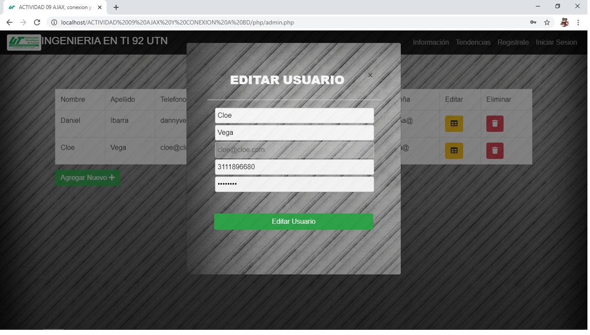
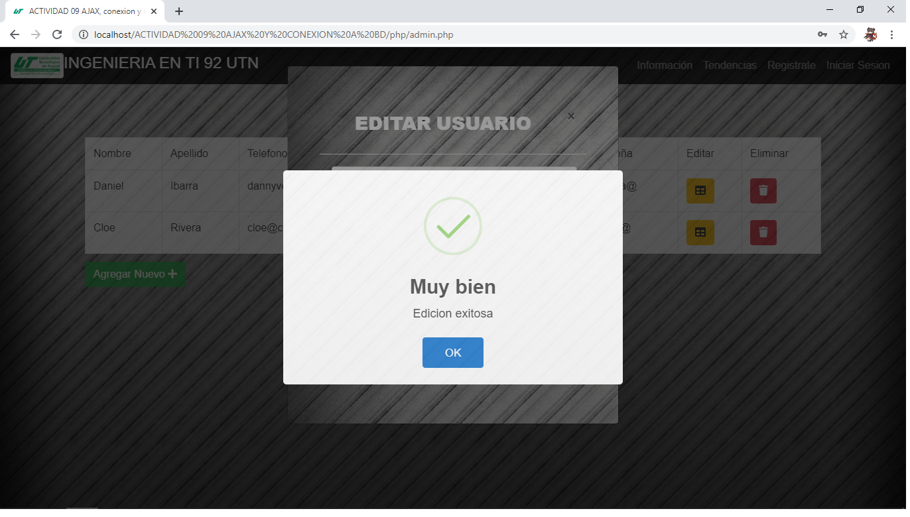
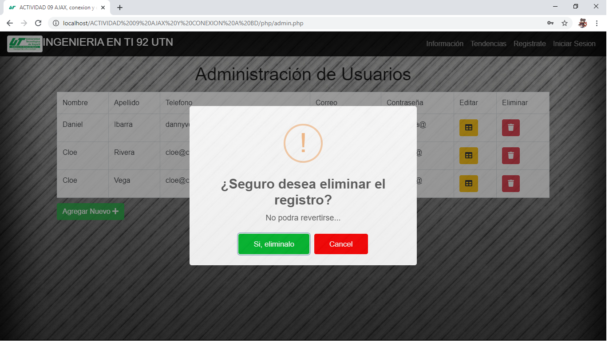
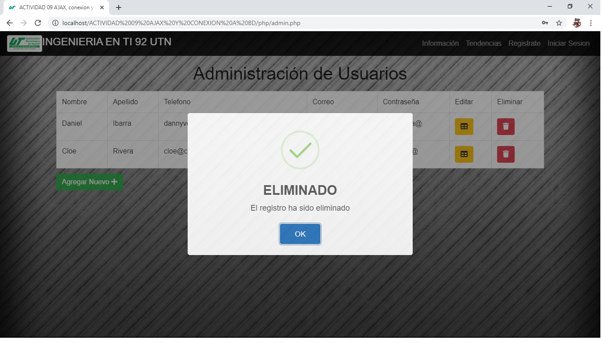

# utn
Practicas realizadas durante la Universidad Tecnológica de Nayarit para la materia de desarrollo web.

En la seccion de LOGIN, este puede distinguir si el usuario existe o no en la BD, de la misma manera en caso de que si exista el usuario puede identificar si el usuario es tipo normal o tipo administrador y redirigilo a si respectiva ventana admin.php o usuario.php

Una vez nos encontramos logeados con una cuenta administradora, podremos tener acceso a toda la informacion de la BD, donde podremos registrar nuevos usuarios desde ahi, este tambien valida si el usuario ya existe o no.

De la misma manera el admin puede EDITAR y/o ELIMINAR usuarios de la BD

Como se puede ver en el fondo por AJAX el usuario ha sido modificado

Lo mismo aplica para la eliminacion, se ve reflejada en axaj correctamente

